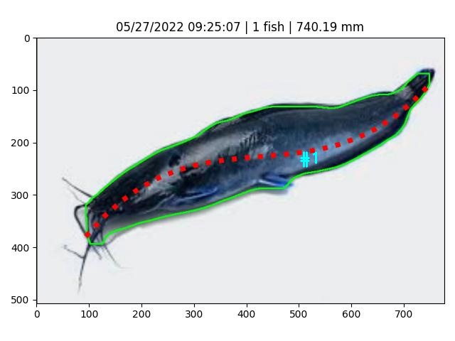

# fish-length-opencv
by @mahaamesha

<br>

# Contents
- [About](#about)
- [Usage](#usage)
- [Result](#result)

<br>

## About <a name='about'></a>
I want to measure length of fish. I use opencv to process the original image. 
The core of the result is based on image segmentation process. 

- **Segmentation Process** \
    The method that I use for segmentation is **watershed algorithm**. I also create some adaptation so that the result become more accurate (check [segmentation.py](./src/segmentation.py)).

- **Measure Length Process** \
    To measure the fish length, I try to use **3nd degree polynomial fitting**. This make good result enough for sample image.
    > The other method I have tried is **skeleton method**, but the skeleton not coverage edge-to-edge of the fish.

    > **Fitting method** can handle that, but the limitation is the function equation only give good result for landscape image.

- **Validating Process** \
    To validate raw measurements, I use elimination of datum based on **dynamic average value**. This will remove small data whose value less than `under_limit`. To handle close objects, generally segmentation will fail, so for large data whose value greater than `upper_limit`, I divide them by it `factor`. Check **`validate_data(data)`** in [mafunction.py](./src/mafunction.py).
    > This will give more accurate result if there are **N > 1** data.

    ```python
    # This will be better if len(data) > 1
    def validate_data(data):
        ...
            elif n > upper:
                factor = int(round(n / avg, 0))
                copy.remove(n)
                for i in range(factor):
                    avg = np.average(copy)
                    copy.append(avg)
        ...
    ```
- **Further Process** \
    I prepare the result to be saved as **.json** and **.bin** file. So, when I need to save the result to database, I can extract the measurement result from json file and the image from bin file.
    > Bin file is encoded string from the image. I can save the encoded string to database. To show the image, I only need to decode the string.

<br>

## Usage <a name='usage'></a>
To run this system, type this below in CMD.
```
python main.py -i img/lele.jpg -w 1
```
> I set the default `-i` for `lele.jpg` with `-w 1`. So, I also run it by `python main.py` sometimes.

<br>

## Result <a name='result'></a>
This is the result.



<br>

# Reference <a name='ref'></a>
- [Image Segmentation with Watershed Algorithm](https://docs.opencv.org/4.x/d3/db4/tutorial_py_watershed.html)
- [IMAGE SEGMENTATION AND MATHEMATICAL MORPHOLOGY](https://people.cmm.minesparis.psl.eu/users/beucher/wtshed.html)